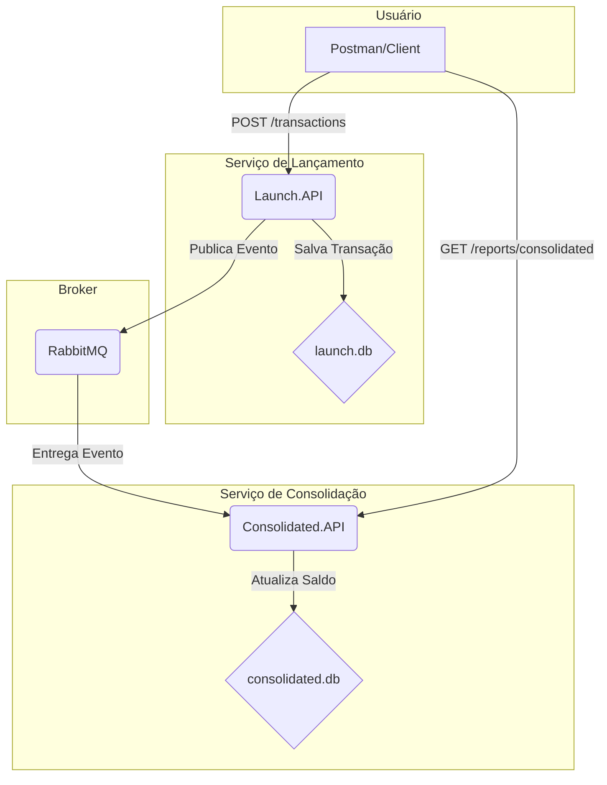

# CashflowEngine

> Um sistema para controle de fluxo de caixa diário, construído com .NET, Microservices, RabbitMQ e Arquitetura Hexagonal.

Este projeto é uma prova de conceito (PoC) que implementa um sistema de fluxo de caixa, separando as operações de lançamento (escrita) e consolidação de saldo (leitura), comunicando-se de forma assíncrona.

## 🏛️ Arquitetura

A solução foi desenhada utilizando uma arquitetura de microsserviços com comunicação assíncrona, aplicando o padrão CQRS (Command Query Responsibility Segregation) na prática.

  * **`Cashflow.Launch.API`**: O microsserviço de **Command**. Sua única responsabilidade é receber, validar e registrar novas transações (créditos e débitos). Após registrar uma transação, ele publica um evento para notificar o restante do sistema.

  * **`Cashflow.Consolidated.API`**: O microsserviço de **Query**. Ele escuta os eventos de novas transações, processa-os e mantém um saldo diário consolidado. Sua responsabilidade é fornecer relatórios de forma rápida e eficiente.

A comunicação entre os serviços é feita pelo **RabbitMQ**, o que garante que os sistemas sejam desacoplados e resilientes. Se o serviço de consolidação estiver offline, por exemplo, os lançamentos continuarão sendo aceitos e serão processados assim que ele voltar a ficar online.

Internamente, cada microsserviço utiliza os princípios de **Arquitetura Hexagonal (Ports & Adapters)**. Isso mantém a lógica de negócio (domínio e casos de uso) limpa e isolada de detalhes de infraestrutura, como o banco de dados ou o message broker, tornando o sistema mais fácil de testar e manter.

### Diagrama de Fluxo



## 🚀 Como Executar Localmente

### Pré-requisitos

  * [Docker](https://www.docker.com/products/docker-desktop/) e Docker Compose
  * [.NET SDK 9.0](https://dotnet.microsoft.com/download/dotnet/9.0) (para executar os comandos de migration)

### Passo a Passo

1.  **Clone o repositório:**

    ```bash
    git clone https://github.com/ivaldobatista/CashflowEngine.git
    cd CashflowEngine
    ```

2.  **Crie os bancos de dados com EF Core Migrations:**
    Como estamos usando uma abordagem "database-first" para o ambiente local, execute os comandos abaixo para criar e aplicar as migrações, gerando os arquivos `launch.db` e `consolidated.db` na pasta `data/`.

    ```bash
    # Migração para o serviço de Lançamento
    dotnet ef database update --project src/Cashflow.Launch/Cashflow.Launch.Infrastructure --startup-project src/Cashflow.Launch/Cashflow.Launch.API

    # Migração para o serviço de Consolidação
    dotnet ef database update --project src/Cashflow.Consolidated/Cashflow.Consolidated.Infrastructure --startup-project src/Cashflow.Consolidated/Cashflow.Consolidated.API
    ```

3.  **Suba os contêineres:**
    O `docker-compose` irá construir as imagens das APIs e iniciar todos os serviços.

    ```bash
    docker compose up --build
    ```

### Endpoints Disponíveis

  * **API de Lançamento**: `http://localhost:8001`
  * **API de Consolidação**: `http://localhost:8002`
  * **RabbitMQ Management**: `http://localhost:15672` (login: `guest` / `guest`)

## ✅ Testando o Fluxo

1.  **Faça um Lançamento**: Envie uma requisição `POST` para `http://localhost:8001/api/v1/transactions` com um corpo JSON:

    ```json
    {
      "date": "2025-09-11",
      "amount": 250.50,
      "type": "Credit",
      "description": "Venda via PIX"
    }
    ```

    Você deve receber uma resposta `201 Created`.

2.  **Consulte o Saldo**: Envie uma requisição `GET` para `http://localhost:8002/api/v1/reports/consolidated/2025-09-11`. Você deve receber uma resposta `200 OK` com o saldo calculado.

## 📝 Decisões Arquiteturais (ADRs)

  * **Uso de Microsserviços (CQRS)**

      * **Decisão**: Separar a funcionalidade em um serviço de escrita (`Launch`) e um de leitura (`Consolidated`).
      * **Justificativa**: Permite que cada serviço escale de forma independente e utilize a melhor abordagem para sua tarefa. O serviço de escrita foca em consistência, enquanto o de leitura pode ser otimizado para performance, por exemplo, com caches.

  * **Comunicação Assíncrona com RabbitMQ**

      * **Decisão**: Utilizar um message broker para a comunicação entre os serviços.
      * **Justificativa**: Promove resiliência e desacoplamento. O serviço de lançamento não precisa saber quem irá consumir seus eventos, e se o serviço consumidor falhar, as mensagens podem ser processadas posteriormente.

  * **Uso de SQLite**

      * **Decisão**: Utilizar SQLite como banco de dados para cada serviço.
      * **Justificativa**: Para uma prova de conceito, SQLite é ideal devido à sua simplicidade. Não requer um servidor separado, é baseado em arquivo e se integra perfeitamente ao EF Core, permitindo focar na arquitetura em vez de na infraestrutura.

## 🌱 Evoluções Futuras

Este projeto é uma base sólida. Para um ambiente de produção, as seguintes melhorias seriam recomendadas:

  * **Cache**: Adicionar uma camada de cache (ex: Redis) em frente ao serviço de consolidação para relatórios ainda mais rápidos.
  * **Testes de Integração**: Implementar testes de integração usando [Testcontainers](https://testcontainers.com/) para validar a interação entre os serviços e a infraestrutura (banco de dados, RabbitMQ) de forma isolada.
  * **Autenticação e Autorização**: Proteger os endpoints com JWT.
  * **Banco de Dados**: Substituir o SQLite por um banco de dados mais robusto para produção, como PostgreSQL ou SQL Server.
  * **Observabilidade**: Implementar logging estruturado, métricas (Prometheus) e tracing distribuído (OpenTelemetry) para monitorar a saúde e o desempenho do sistema.